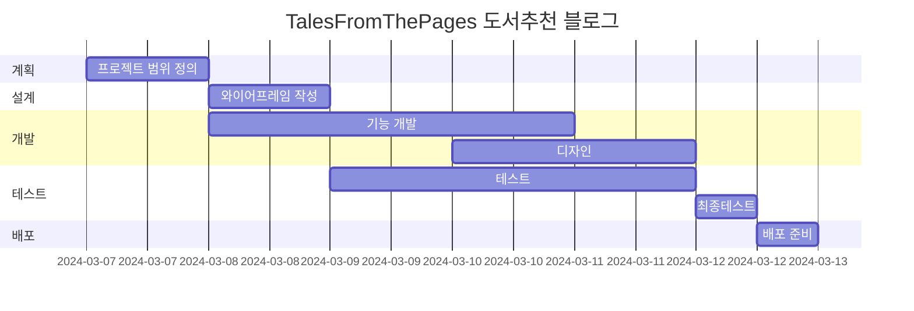
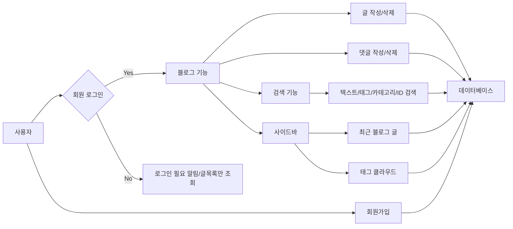

# Tales From The Pages 책 소개 블로그
Tales From The Pages 책 소개 블로그

* 목표
    * 블로그 글, 댓글 CRUD 블로그 기능 구현
    * 사이드바 구현(카테고리, tag Cloud, 검색)
    * 페이징, 댓글, 대댓글 구현

* 사용방법
    1. https://mkdirlife.github.io/TalesFromThePages 로 접속해주세요.
    2. 회원가입을 해주세요. 글을 읽을 수 있고, 작성할 수 있습니다.
    3. 읽고 싶은 Post를 선택해서 읽고, 댓글 을 달아주세요.

* 서비스 URL 정보
    * 실행 URL: https://mkdirlife.github.io/TalesFromThePages
    * blog github repo: https://github.com/mkdirlife/TalesFromThePages

* 개발환경
   * 개발툴 : VSCode
   * 개발프로그램 : HTML, CSS, JavaScript, Django

* WBS


* 화면 정의서
    <table>
        <tr>
            <th>메인화면</th>
            <th>설명</th>
        </tr>
        <tr>
            <td width="70%">
               
            </td>     
            <td>
                <ul>
                    <li>로그인, 로그아웃 구현</li>
                    <li>검색 기능 구현</li>
                </ul>
            </td>
        </tr>
        <tr>
            <td width="70%">
               
            </td>              
            <td>
                <ul>
                    <li>카테고리 구현</li>
                    <li>댓글, 대댓글 구현</li>
                    <li>tag 조회 구현</li>                   
                </ul>
            </td>
        </tr>       
    </table>

* 흐름도


* ERD
    <table>
        <tr>
           
        </tr>
    </table>

* 폴더 구조
```
django_blog/
│
├── account/                     사용자 인증, 회원가입, 로그인 사용자 계정 관련 기능
│   ├── migrations/
│   ├── __init__.py
│   ├── admin.py
│   ├── apps.py
│   ├── forms.py                     사용자 프로필을 업데이트 사진, 소개 메시지, email 필드를 통해 업데이트 기능
│   ├── models.py                    UserProfile class 만들어서 User 모델의 기본필드 유지하고, 추가적인 프로필 정보 정의
│   ├── tests.py
│   ├── urls.py                      view class 와 URL 패턴을 매핑
│   └── views.py                     계정관련 view class / 로그인, 로그아웃, 회원가입, 프로필 수정 등의 기능을 처리
│
├── blog/                        글작성, 삭제, 댓글작성, 삭제 등 블로그 기능 
│   ├── migrations/
│   ├── __init__.py
│   ├── admin.py                     관리자 페이지에서 모델을 등록하고 관리
│   ├── apps.py
│   ├── forms.py                     블로그 관련 form class 정의, 블로그글 작성, 수정, 댓글 작성, 태그작성, 카테고리 생성
│   ├── models.py                    Blog, Comment, Tag, Category 데이터 구조 정의
│   ├── tests.py
│   ├── urls.py                      view class 와 URL 패턴을 매핑
│   └── views.py                     블로그 글 목록, 상세 페이지, 글 작성, 수정, 삭제 등의 기능을 처리
│
├── config/                     Django 프로젝트의 설정 파일 폴더
│   ├── __init__.py
│   ├── asgi.py
│   ├── settings.py                  프로젝트 설정 파일
│   ├── urls.py                      프로젝트 URL 정의 파일
│   └── wsgi.py
│
├── media/                     사용자 업로드 미디어 파일 저장 폴더
│
├── static/                    CSS, JavaScript 등 정적 파일 저장 폴더
│
├── templates/                 HTML 템플릿 파일 폴더
│   ├── accounts/
│   │   ├── form.html                회원가입 폼
│   │   ├── profile.html             프로필 템플릿
│   │   ├── user_login.html          로그인 템플릿
│   |   └── user_signup.html         회원가입 템플릿
│   ├── blog/
│   │   ├── _comment.html            댓글 작성자의 프로필 사진 표시, 댓글 표시
│   │   ├── blog_delete.html         블로그글 삭제
│   │   ├── blog_detail.html         블로그글 선택시 보여지는 템플릿
│   │   ├── blog_list.html           블로그글 리스트 템플릿(메인페이지)
│   │   ├── comment_delete.html      댓글 삭제
│   |   └── form.html                블로그 글 작성 폼
│   └── base.html               여러 html에 사용할 header, footer 포함한 기본 템플릿
├── db.sqlite3        Django의 기본 데이터베이스 파일
│
└── manage.py         Django 프로젝트를 관리
```

* 에러와 에러 해결(트러블슈팅 히스토리)
    1. 지속적인 model의 변경으로 인한 data 꼬임현상
    2. 유효성 검사(폼 입력후 유효하지 않을 경우 입력한 값들이 사라지는 문제, 특히 이미지업로드 시 파일경로 재설정 문제)
    3. 이름이 맞지 않아 생기는 수 많은 오류들(긴 시간을 헤메게 하는 원인이었음)
    4. 부트스트랩 선정후 마음에 안드는 부분들을 미세하기 조정은 하지만 처음부터 잘 골라야 한다고 생각이 듬.(예전스타일 코드, 위치, 사이즈 변경 시 어울리지 않는 문제)
    


* 참고


