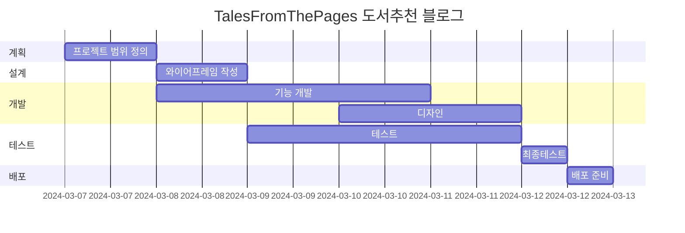
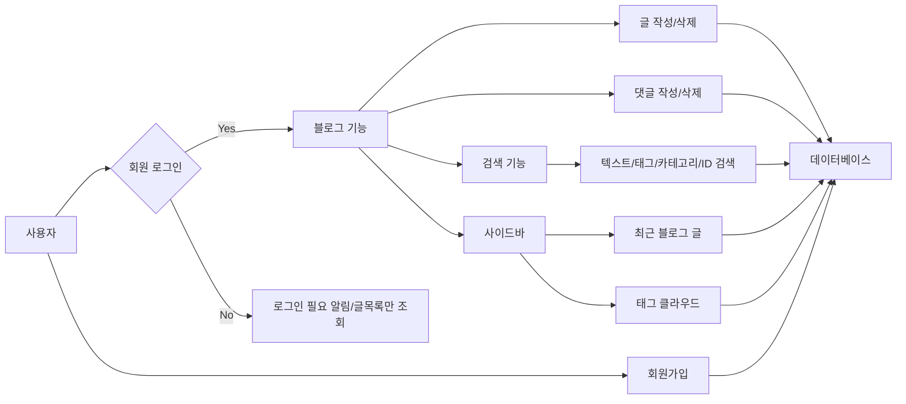

# Tales From The Pages 책 소개 블로그
Tales From The Pages 책 소개 블로그

* 목표
    * CRUD 기본적인 블로그 기능 구현
    * 사이드바 구현(카테고리, tag Cloud, 검색)
    * 페이징, 댓글, 대댓글 구현

* 사용방법
    1. https://mkdirlife.github.io/TalesFromThePages 로 접속해주세요.
    2. 회원가입을 해주세요. 글을 읽을 수 있고, 작성할 수 있습니다.
    3. 읽고 싶은 Post를 선택해서 읽고, 댓글 을 달아주세요.

* 서비스 URL 정보
    * 실행 URL: https://mkdirlife.github.io/TalesFromThePages
    * blog github repo: https://github.com/mkdirlife/TalesFromThePages

* 개발환경
   * 개발툴 : VSCode
   * 개발프로그램 : HTML, CSS, JavaScript, Django

* WBS


* 화면 정의서
    <table>
        <tr>
            <th>메인화면</th>
            <th>설명</th>
        </tr>
        <tr>
            <td width="70%">
               
            </td>     
            <td>
                <ul>
                    <li>로그인, 로그아웃 구현</li>
                    <li>검색 기능 구현</li>
                </ul>
            </td>
        </tr>
        <tr>
            <td width="70%">
               
            </td>              
            <td>
                <ul>
                    <li>카테고리 구현</li>
                    <li>댓글, 대댓글 구현</li>
                    <li>tag 조회 구현</li>                   
                </ul>
            </td>
        </tr>       
    </table>

* 흐름도


* ERD
    <table>
        <tr>
           
        </tr>
    </table>

* 폴더 구조
```
```

* 에러와 에러 해결(트러블슈팅 히스토리)
    1. 지속적인 model의 변경으로 인한 data 꼬임현상
    2. 유효성 검사(폼 입력후 유효하지 않을 경우 입력한 값들이 사라지는 문제, 특히 이미지업로드 시 파일경로 재설정 문제)
    3. 이름이 맞지 않아 생기는 수 많은 오류들(긴 시간을 헤메게 하는 원인이었음)
    4. 부트스트랩 선정후 마음에 안드는 부분들을 미세하기 조정은 하지만 처음부터 잘 골라야 한다고 생각이 듬.(예전스타일 코드, 위치, 사이즈 변경 시 어울리지 않는 문제)
    


* 참고


