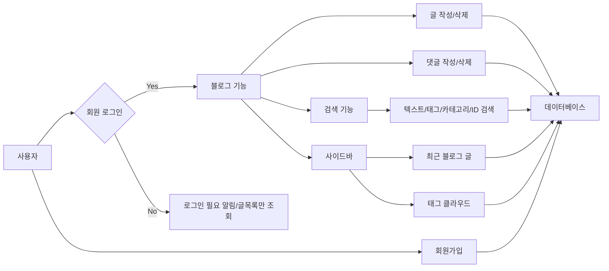
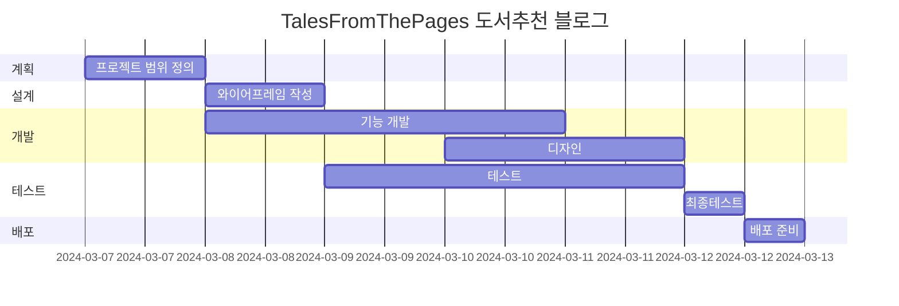

# Tales From The Pages 책 추천 블로그
Tales From The Pages 책 추천 블로그

* 목표
    * CRUD 기본적인 블로그 기능 구현
    * 댓글, 대댓글 구현
    * 카테고리 구현

* 사용방법
    1. https://mkdirlife.github.io/TalesFromThePages 로 접속해주세요.
    2. 회원가입을 해주세요. 글을 읽을 수 있고, 작성할 수 있습니다.
    3. 읽고 싶은 Post를 선택해서 읽고, 댓글 을 달아주세요.

* 서비스 URL 정보
    * 실행 URL: https://mkdirlife.github.io/TalesFromThePages
    * blog github repo: https://github.com/mkdirlife/TalesFromThePages

* 개발환경
   * 개발툴 : VSCode
   * 개발프로그램 : HTML, CSS, JavaScript
   * 서비스 배포 : GitHub    

* 흐름도


* 폴더 구조
```
```

* 코드 컨벤션과 변수 컨벤션
   * 들여쓰기 tab(4칸)
   * 자바스크립트 카멜표기법
   * HTML class명은 '역할-태그명' 형태


* WBS

* 구현 하고자 하는 내용 정리
   1. 댓글, 대댓글 작성 가능
   2. 댓글, 대댓글 삭제 시 삭제되었습니다. 라는 메시지 띄우고 DB에서는 삭제하지 않음.
   3. 삭제되었습니다. 상태에서 한 달 지났을때 자동 삭제
   4. 글삭제 시 에는 모든 댓글, 대댓글 삭제
   5. 글 작성 시 별점 부여 하는 방법 고려 제목에 포함되서 보이도록 할 예정.

* 시퀀스 다이어그램
```mermaid
```


* ERD
    <table>
        <tr>
           
        </tr>
    </table>


* 화면 정의서
    <table>
        <tr>
            <th>메인화면</th>
            <th>설명</th>
        </tr>
        <tr>
            <td width="70%">
               
            </td>     
            <td>
                <ul>
                    <li>로그인, 로그아웃 구현</li>
                    <li>검색 기능 구현</li>
                </ul>
            </td>
        </tr>
        <tr>
            <td width="70%">
               
            </td>              
            <td>
                <ul>
                    <li>카테고리 구현</li>
                    <li>댓글, 대댓글 구현</li>
                    <li>tag 조회 구현</li>                   
                </ul>
            </td>
        </tr>       
    </table>

* 애러와 애러 해결(트러블슈팅 히스토리)
    * HTML 설계

    * 유효성 검사

    * 문장길이 조절로 가독성 확보


* 참고


