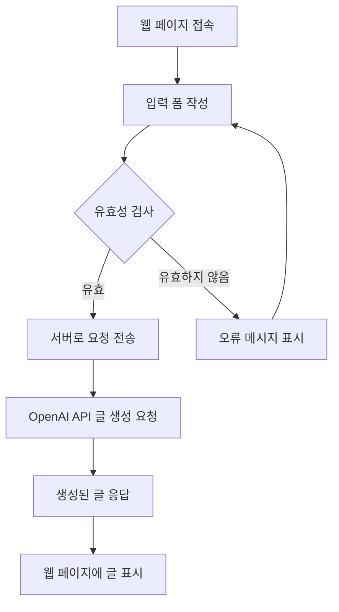
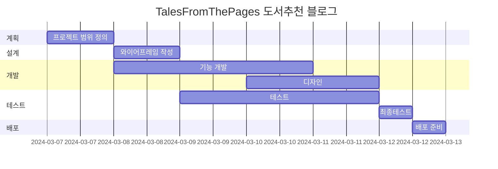
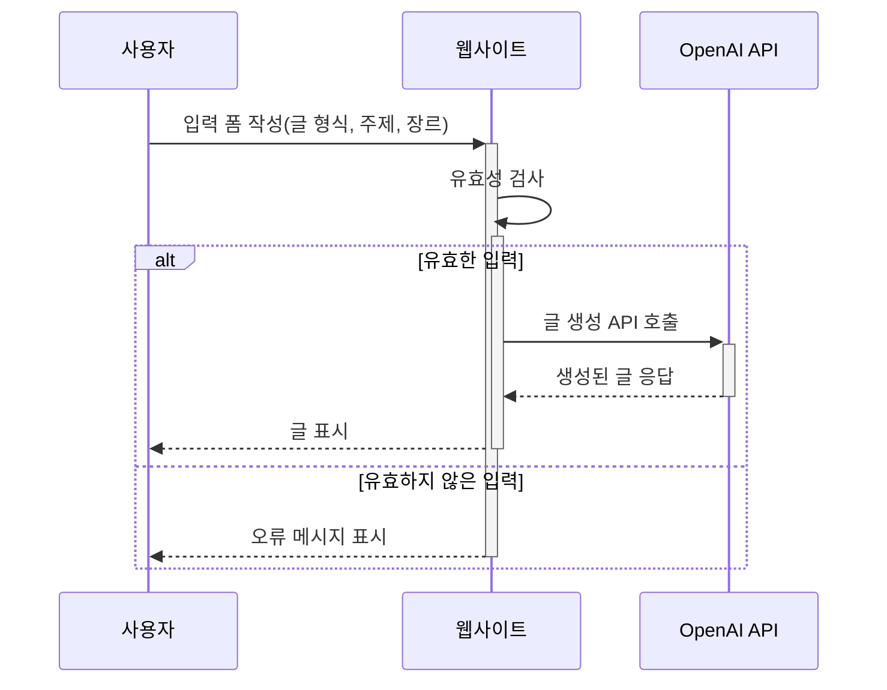

# Tales From The Pages 책 추천 블로그
Tales From The Pages 책 추천 블로그

* 목표
    * 기본적인 블로그 기능 구현
    * 책 추천 블로그를 위해 별점 시스템 과 공유 기능 구현

* 사용방법
    1. https://mkdirlife.github.io/TalesFromThePages 로 접속해주세요.
    2. 읽고 싶은 Post를 선택해서 읽고, 댓글 을 달아주세요.

* 서비스 URL 정보
    * 실행 URL: https://mkdirlife.github.io/TalesFromThePages
    * blog github repo: https://github.com/mkdirlife/TalesFromThePages

* 개발환경
   * 개발툴 : VSCode
   * 개발프로그램 : HTML, CSS, JavaScript
   * 서비스 배포 : GitHub    

* 흐름도


* 폴더 구조
```
HTML_CSS project
├── images
│   └── writing.png
├── js
│   └── index.js
├── styles
│   ├── common.css
│   ├── reset.css
│   └── style.css
└── index.html
```

* 코드 컨벤션과 변수 컨벤션
   * 들여쓰기 tab(4칸)
   * 자바스크립트 카멜표기법
   * HTML class명은 '역할-태그명' 형태


* WBS


* 시퀀스 다이어그램


* 화면 정의서
    <table>
        <tr>
            <th>메인화면</th>
            <th>설명</th>
        </tr>
        <tr>
            <td width="70%">
            </td>
            <td>
                <ul>
                    <li></li>
                </ul>
            </td>
        </tr>
    </table>

* 애러와 애러 해결(트러블슈팅 히스토리)
    * HTML 설계
        * inline 요소와 block 요소를 정확하게 인지하지 못해서 나오는 실수, 마진, 패딩 처리들로 시간을 많이 할애함.
          여전히 제일 부족함. ChatGPT에 많이 의존했으나 정답을 얘기해주지는 못해서 시간이 오래걸림.
    * 유효성 검사
        * 유효하지 않은 값이 결국에는 결과에도 영향을 미친다고 생각해서 필요없는 값들의 입력을 걸러주려고 함.<br>
          input 이 여러개이다 보니 한 번에 유효성 체크하기가 쉽지 않았음.<br>
          자음, 모음만 입력하는 경우 숫자가 입력하는 경우들이 있을때는 에러메시지 표기함.<br>
          submit 이 복잡해지는 관계로 추후에 유효성 검사 하는 부분만 함수로 빼서 처리함.<br>
          의미없는 단어나 영문 입력을 제외하고 싶었으나 아이디어가 떠오르지 않았음.<br>
    * 문장길이 조절로 가독성 확보
        * api에 요청후 받은 결과값이 500자, 1000자 한번에 오다 보니 적당한 크기로 줄바꿈이 있어야 했음.<br>
          사이즈 고려해서 80자 정도로 정했으나 짧은 문장이 많이 나오거나 마침표 다음에 바로 문장이 나오거나<br>
          하는 문제로 보기 좋게 줄바꿈을 하기가 쉽지 않았음.<br>
          문장 단위로 배열에 놓고, 길이 체크해서 줄바꿈 하는 것으로 수정했으나 한 문장에 80자가 넘는 경우와<br>
          문장 의미에 따른 문단 구분 등은 하지 못했음. 정규표현식은 chatGPT의 도움을 받음.<br>

* 참고
    * https://www.figma.com/file/Hr6ifwSCHj2HFdtMK2JkMP/%EB%AA%A8%EB%91%90%EC%9D%98%EC%97%B0%EA%B5%AC%EC%86%8C_%EC%98%A4%EB%A6%84%EC%BA%A0%ED%94%84_AI-%ED%99%9C%EC%9A%A9-%EB%B0%B1%EC%97%94%EB%93%9C-%EA%B0%9C%EB%B0%9C-%EA%B3%BC%EC%A0%95?type=design&node-id=110062-12&mode=design&t=1pdcGnsm2nFNdGVS-0 스타일을 참고


