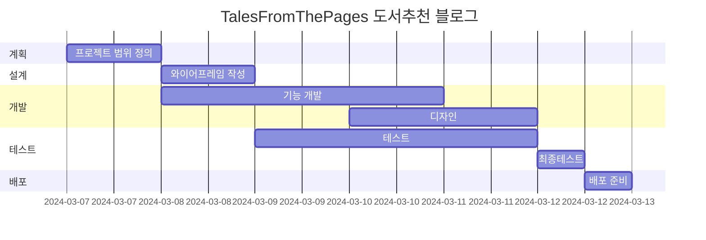

# Tales From The Pages 책 추천 블로그
Tales From The Pages 책 추천 블로그

* 목표
    * 기본적인 블로그 기능 구현
    * 책 추천 블로그를 위해 별점 시스템 과 공유 기능 구현

* 사용방법
    1. https://mkdirlife.github.io/TalesFromThePages 로 접속해주세요.
    2. 읽고 싶은 Post를 선택해서 읽고, 댓글 을 달아주세요.

* 서비스 URL 정보
    * 실행 URL: https://mkdirlife.github.io/TalesFromThePages
    * blog github repo: https://github.com/mkdirlife/TalesFromThePages

* 개발환경
   * 개발툴 : VSCode
   * 개발프로그램 : HTML, CSS, JavaScript
   * 서비스 배포 : GitHub    

* 흐름도
```mermaid
```

* 폴더 구조
```
```

* 코드 컨벤션과 변수 컨벤션
   * 들여쓰기 tab(4칸)
   * 자바스크립트 카멜표기법
   * HTML class명은 '역할-태그명' 형태


* WBS


* 시퀀스 다이어그램
```mermaid
```

* 화면 정의서
    <table>
        <tr>
            <th>메인화면</th>
            <th>설명</th>
        </tr>
        <tr>
            <td width="70%">
            </td>
            <td>
                <ul>
                    <li></li>
                </ul>
            </td>
        </tr>
    </table>

* 애러와 애러 해결(트러블슈팅 히스토리)
    * HTML 설계

    * 유효성 검사

    * 문장길이 조절로 가독성 확보


* 참고


